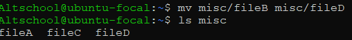

# Excercise:

  >Your login name: altschool i.e., home directory /home/altschool. The home directory contains the following sub-directories: code, tests, personal, misc Unless otherwise specified, you are running commands from the home directory 
  

  `vagrant@ubuntu-focal:~$ sudo useradd -m Altschool` // Create user Altschool(root user)

  `Altschool@ubuntu-focal:~$ mkdir code tests personal misc` // Create folders

 ## Instructions:
  > A. Change directory to the tests directory using absolute pathname

   . . .

  

  . . .

 > B. Change directory to the tests directory using relative pathname

   . . .
  
  

   . . .

  > C. Use echo command to create a file named fileA with text content "Hello A' in the misc directory

  . . .

  

  . . .

  > D. Create an empty file named fileB in the misc directory. Populate the file with a dummy content afterwards

   . . .

  

   . . .

  > E.Copy contents of fileA into fileC

   . . .

  

   . . .

  > F. Move content of fileB into fileD

  . . .

  

  . . .

  > G. Create a tar archive called misc.tar for the content of misc directory

   . . .

   

   . . .

   > H. Compress the tar archive to create a misc.tar.gz file

   . . .

   

   . . .

   >I. Create a user and force the user to change his/her password upon login

   . . .

   

   . . .

   >J. Lock a users password

   . . . 

   

   . . .

   >K. Create a user with no login shell

   . . .

   

   . . .

   >L . Disable password based for ssh

   . . .
   
    Altschool@ubuntu-focal:~$ sudo vi /etc/ssh/sshd_config
   

   . . .

   >M. Disable root login for ssh

   . . .

       Altschool@ubuntu-focal:~$ sudo vi /etc/ssh/sshd_config
   
    

